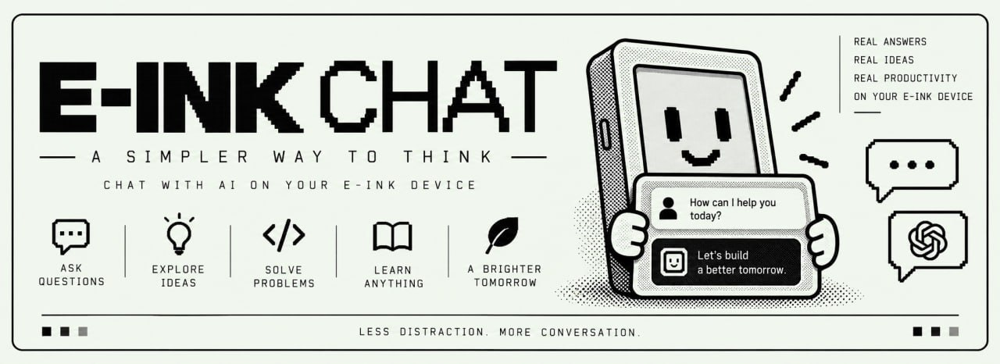

<p align="center">
  
</p>

<h1 align="center">E-INK CHAT</h1>

<p align="center">
  <strong>An offline chat that runs entirely on the Kindle.</strong><br />
  Nothing leaves the device.
</p>

<p align="center">
  
  
  
  
  
</p>

<p align="center">
  <a href="#on-the-kindle">On the Kindle</a>
  ·
  <a href="#on-your-desk">On your desk</a>
  ·
  <a href="#the-two-modes">The two modes</a>
  ·
  <a href="#make-it-yours">Make it yours</a>
  ·
  <a href="#community">Community</a>
</p>

---

Two modes, picked by what is installed on the device:

| | model | runtime | what it does |
|---|---|---|---|
| **chat** | SmolLM2-135M-Instruct, Q4_K_M (101 MB) | **llama.cpp** | you ask a question, it answers |
| story | TinyStories 15M | **llama2.c** | continues a story — a base model, so it cannot answer |

Three doors onto the same app under `/mnt/us/extensions/kindlechat`:

| | **Library** | **Reader** | **Window** |
| --- | --- | --- | --- |
| What it is | Story on the framebuffer | Chat or stories, with a keyboard | Chat in a native GTK window |
| Where | `chat.sh` in the library | KOReader → Tools | `chat-ui.sh` in the library |
| Needs | `llama` + TinyStories | the same, or `llama-completion` + a `.gguf` | `chat-ui` + `llama-server` + a `.gguf` |

Status: story mode measured **8.2 tok/s on a KT4**. Chat mode is built,
deployed and running; its speed on the device is the outstanding measurement.
The long story, with the numbers and the dead ends, is in
[docs/engineering.md](docs/engineering.md).

> [!NOTE]
> A house project of **E-INK HACK**. The workshop is on
> [Discord](https://discord.gg/KYChSeuyk) — Kindle, Kobo, any e-ink panel.

---

## On the Kindle

### Library

The scriptlet draws with fbink and stays up until you tap. It is the story
mode: TinyStories continues a prompt. No keyboard.

```
chat.sh                    →  /mnt/us/documents/chat.sh
chat.conf                  →  /mnt/us/extensions/kindlechat/chat.conf
out/llama                  →  /mnt/us/extensions/kindlechat/llama
model/stories15M.bin       →  /mnt/us/extensions/kindlechat/model/stories15M.bin
vendor/tokenizer.bin       →  /mnt/us/extensions/kindlechat/model/tokenizer.bin
```

Eject. It shows up as **E-INK HACK**, with the cover from `docs/cover.jpg` as
the library icon (embedded in the scriptlet, so the `.sh` file is enough). Tap
to open, tap again to go back. If a file is missing, the scriptlet itself shows
an error screen explaining what.

`tools/deploy.ps1` copies this pair (and the optional Q8 / chat files if they
are built) and verifies every file by hash.

### Reader

The KOReader plugin is the keyboard. It opens a full-screen **Chat** or
**Stories** dialog: Ask / Write, Stop while the model is writing, Clear.
Turns are labelled You / Kindle. The plugin does not run the model; it starts
`run-model.sh` under `/mnt/us/extensions/kindlechat` and polls the output
back onto the screen.

```sh
cp -r kindlechat.koplugin /path/to/koreader/plugins/
```

Restart KOReader, then **Tools → E-INK HACK**. Chat mode if a `.gguf` and
`llama-completion` are installed; stories otherwise.

### Window

`chat-ui` is a GTK window over `llama-server`. No KOReader. Chat mode only.

```
out/chat-ui-kindle  →  /mnt/us/extensions/kindlechat/chat-ui
out/llama-server    →  /mnt/us/extensions/kindlechat/llama-server
chat-ui.sh          →  /mnt/us/documents/chat-ui.sh
```

Eject. It shows up as **E-INK HACK CHAT**, same cover as the scriptlet. The
window is GTK over the X server the framework already runs: You / Kindle
bubbles (user inverted, reply framed), an Ask / Stop / New row, and an
on-screen QWERTY. After each answer it runs `REFRESH_CMD` (`fbink -q -s` by
default) so streaming does not leave ghosting. It starts and stops
`llama-server` itself when nothing is listening on `127.0.0.1:8080`. To use
the framework's keyboard instead, start it once with `--native-keyboard`.

The same source builds against **GTK 3** on the desk and **GTK 2** on the
Kindle (the SDK has no GTK 3). Build the window with
`sh tools/build-chatui.sh --kindle` (koxtoolchain plus the Kindle SDK; the
script prints the steps when something is missing) and the backend with
`sh tools/build-llamacpp.sh --server` (Zig, static musl).

`deploy.ps1` does not copy this pair yet.

### Chat mode

The `.gguf` is large enough to stay out of the repository. Fetch it, build
the runner, put both next to the app, and the plugin (or the native window)
starts answering questions instead of continuing stories:

```sh
WITH_CHAT=1 sh tools/fetch.sh          # model/SmolLM2-135M-Instruct-Q4_K_M.gguf
sh tools/build-llamacpp.sh             # -> out/llama-completion
sh tools/build-llamacpp.sh --server    # -> out/llama-server  (for chat-ui)
```

```
out/llama-completion                    →  /mnt/us/extensions/kindlechat/llama-completion
model/SmolLM2-135M-Instruct-Q4_K_M.gguf →  /mnt/us/extensions/kindlechat/model/
```

## On your desk

Dependencies (llama2.c sources + TinyStories 15M, ~58 MB):

```sh
sh tools/fetch.sh                # or, on Windows: .\tools\fetch.ps1
WITH_CHAT=1 sh tools/fetch.sh    # + SmolLM2-135M-Instruct Q4_K_M (~101 MB)
```

Build llama2.c with Zig — no WSL, no Docker, no toolchain:

```sh
./build.sh                       # -> out/llama
SRC=runq.c ./build.sh            # -> out/llama-q8 (quantized model)
```

On Windows: `.\build.ps1` (or `.\build.ps1 -Src runq.c`). The build ends by
checking the ELF: ARM, EABI5, hard-float, self-contained.

Try it on the PC before copying:

```sh
TARGET=host ./build.sh
./out/llama model/stories15M.bin -z vendor/tokenizer.bin -n 80 -i "Once upon a time"
```

Tests, with no Kindle around:

```sh
sh tests/functional.sh                  # chat.sh against a fake llama
sh kindlechat.koplugin/tests/test-run-model.sh
cd kindlechat.koplugin/tests && lua test_engine.lua
sh tests/chatui-smoke.sh                # GTK host build + parsing tests
```

And inside a real headless KOReader (uses the `dev-tools` folder from the
[e-ink-hack](https://github.com/kumanaya/e-ink-hack) workshop):

```sh
sh ../dev-tools/koreader-headless.sh kindlechat.koplugin kindlechat.koplugin/tests/koreader-probe.lua
```

The native window on the desk (GTK 3 development files):

```sh
sh tools/build-chatui.sh              # -> out/chat-ui
./out/chat-ui                         # starts llama-server itself when it finds a .gguf
```

`build-llamacpp.sh --server` produces an ARM `llama-server` for the Kindle.
On the desk, point `chat-ui` at a `llama-server` you already have listening,
or let it spawn one if `llama-server` is on `PATH`.

## The two modes

| | story | chat |
|---|---|---|
| Model | TinyStories 15M, base | SmolLM2-135M-Instruct, Q4_K_M |
| Runtime | llama2.c (`out/llama`) | llama.cpp (`llama-completion` or `llama-server`) |
| Context | 256 tokens | 1024 tokens (`-c 1024`) |
| Prompt | plain continuation | ChatML template |
| Needs | binary + `stories15M.bin` | binary + a `.gguf` |
| Who uses it | `chat.sh`, the plugin | the plugin, `chat-ui` |

The plugin picks chat mode when it finds a `.gguf` and `llama-completion`,
and falls back to story mode otherwise. `chat-ui` is chat only: no `.gguf`,
no window.

Why llama.cpp for chat: llama2.c's tokenizer is SentencePiece-based and every
small instruct model uses BPE; a 135M model in fp32 does not fit in the
512 MB; and llama.cpp's integer kernels use NEON, which is exactly what the
compiler refuses to do for floating point on this CPU. The numbers are in
[docs/engineering.md](docs/engineering.md) and
[docs/model-choice.md](docs/model-choice.md).

## Make it yours

Everything in `chat.conf` (it is shell, loaded with `.`) is for the
**library** scriptlet:

| Key | Default | What it does |
|---|---|---|
| `PROMPT` | `Once upon a time, there was a little robot` | Text sent to the model |
| `STEPS` | `80` | Tokens to generate (prompt + steps within the 256-token context) |
| `TEMP` / `TOPP` | `0.8` / `0.9` | Sampling |
| `STREAM_LINE` | `8` | Line where the generated text starts |
| `STATUS_LINE` | `28` | Status line (tok/s) |
| `MAX_WAIT` | `600` | Cap on waiting for the tap, in seconds |

The KT4 panel is **600×800**. Adjust `STREAM_LINE` and `STATUS_LINE` if text
runs off the screen. `chat.sh` prefers the fp32 pair on purpose (it measured
faster); uncomment `BIN`/`MODEL` in `chat.conf` to force the Q8_0 pair.

The plugin uses its own defaults (`steps=60`, `temp=0.8`, `topp=0.9`,
`ctx=1024` in chat mode). They are not read from `chat.conf`.

The native window has its own knobs (`./out/chat-ui --help`): `--font-size`,
`--max-turns` (messages kept in the request), `--no-spawn`, `--server-bin`,
`--server-args` and `--refresh-cmd` (an e-ink housekeeping command run after
each answer).

```
docs/banner.jpg            the masthead above
docs/cover.jpg             the library cover, embedded as # Icon: in the scriptlets
chat.sh                    library: story mode (fbink)
chat-ui.sh                 library: native GTK window
kindlechat.koplugin/       KOReader app
```

---

<h2 align="center">Community</h2>

<p align="center">
  A house project of <strong>E-INK HACK</strong>.<br />
  Kindle, Kobo, or anything with a slow, honest screen — bring the hack.
</p>

<p align="center">
  <a href="https://discord.gg/KYChSeuyk">
    
  </a>
</p>

<table align="center">
  <tr>
    <td align="center" width="220">
      <a href="https://discord.gg/KYChSeuyk">
        <br />
        <sub>Where the hacks land</sub>
      </a>
    </td>
    <td align="center" width="220">
      <a href="https://github.com/kumanaya/eink-chat">
        <br />
        <sub>This chat</sub>
      </a>
    </td>
    <td align="center" width="220">
      <a href="https://x.com/danielkumanaya">
        <br />
        <sub>What we are shipping</sub>
      </a>
    </td>
  </tr>
</table>

---

MIT for the app, AGPL-3.0 for the plugin. See [LICENSE](LICENSE) and
[kindlechat.koplugin/LICENSE](kindlechat.koplugin/LICENSE). The vendored
llama2.c sources under `vendor/` keep their own MIT license, from
[karpathy/llama2.c](https://github.com/karpathy/llama2.c).
